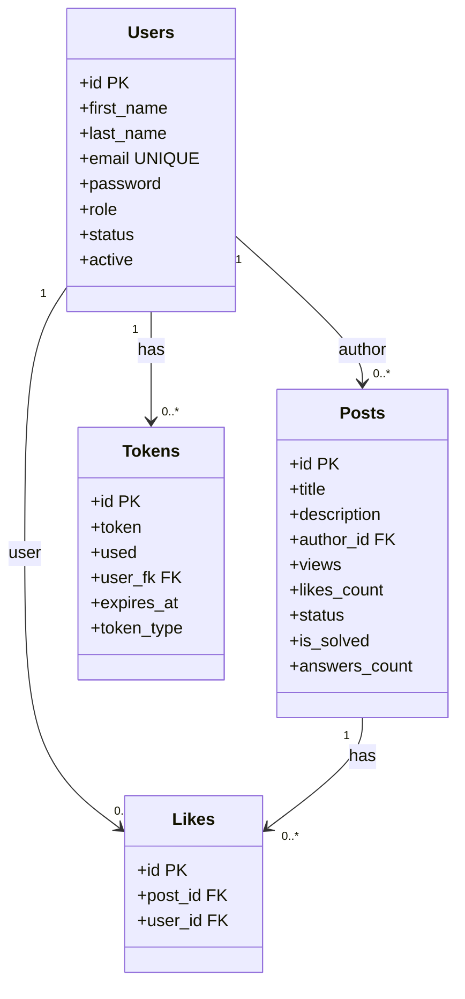

# Diagrama ER con classDiagram (compatible Mermaid)

```mermaid
classDiagram
    class Users {
        +id PK
        +first_name
        +last_name
        +email UNIQUE
        +password
        +role
        +status
        +active
    }

    class Posts {
        +id PK
        +title
        +description
        +author_id FK
        +views
        +likes_count
        +status
        +is_solved
        +answers_count
    }

    class Likes {
        +id PK
        +post_id FK
        +user_id FK
    }

    class Tokens {
        +id PK
        +token
        +used
        +user_fk FK
        +expires_at
        +token_type
    }

    Users "1" --> "0..*" Posts : author
    Users "1" --> "0..*" Likes : user
    Users "1" --> "0..*" Tokens : has
    Posts "1" --> "0..*" Likes : has
```
